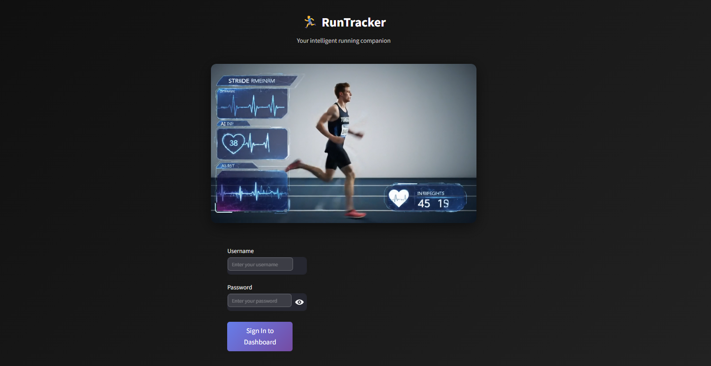
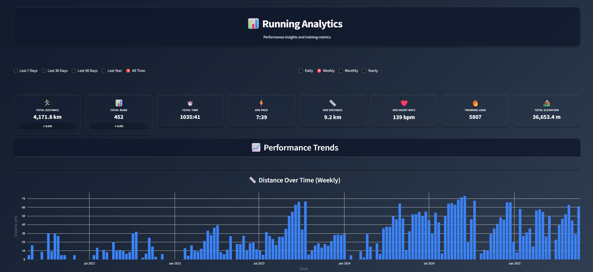
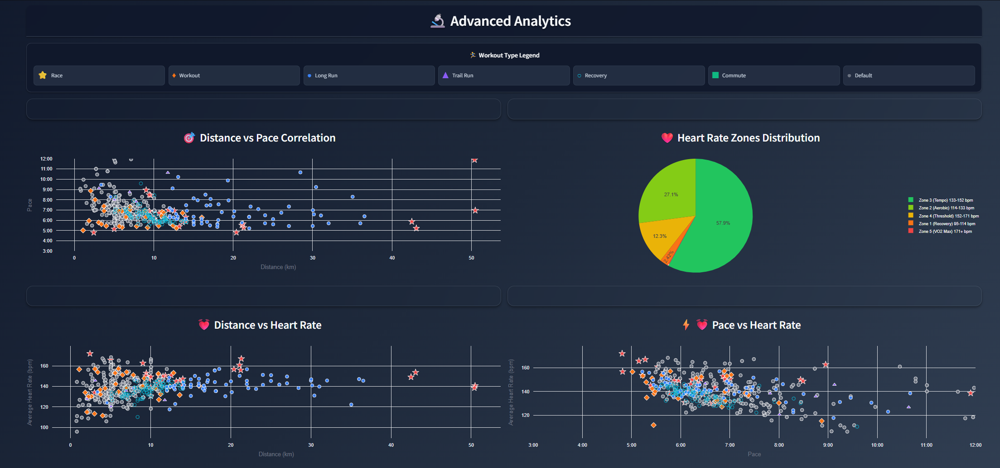
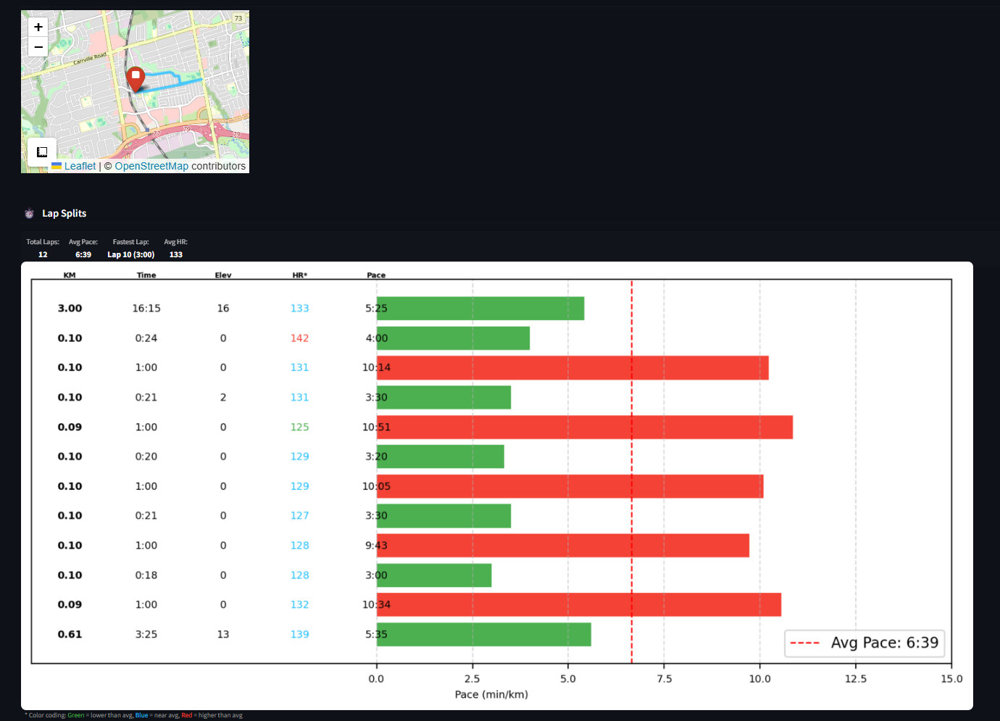
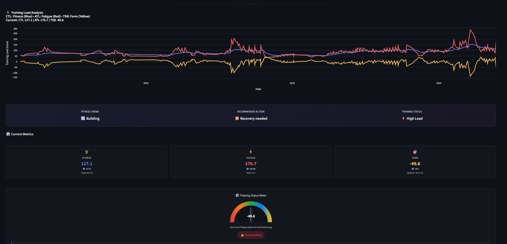
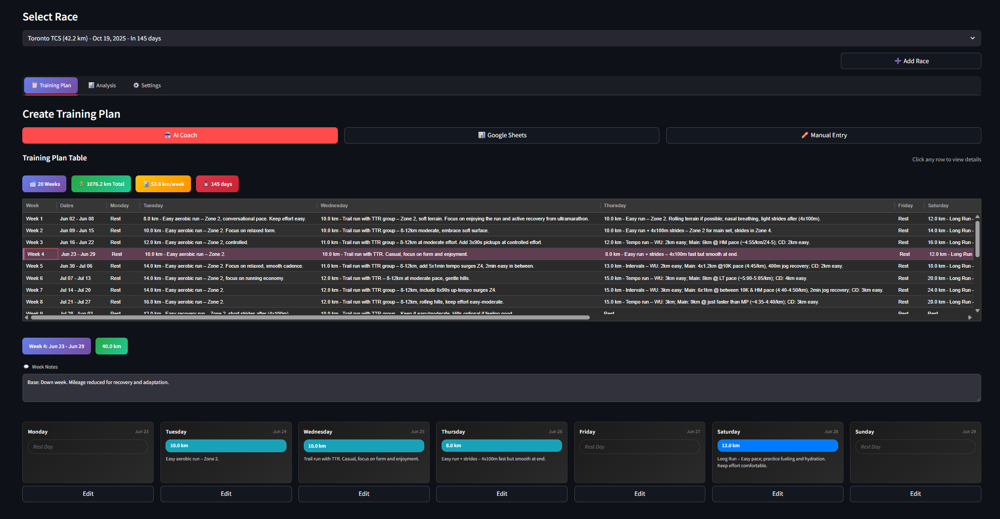

# 🏃‍♂️ RunTracker

**Your intelligent running companion** - A comprehensive running analytics dashboard built with Streamlit that transforms your training data into actionable insights.



## ✨ Features

### 📊 **Comprehensive Analytics Dashboard**
Transform your running data into beautiful, interactive visualizations with mobile-optimized responsive design.



**Key Metrics at a Glance:**
- Total Distance & Runs
- Average Pace & Heart Rate  
- Training Load & Elevation Gain
- Time-based filtering (7 days to All Time)
- Multiple aggregation views (Daily, Weekly, Monthly, Yearly)

### 📈 **Advanced Performance Analytics**
Deep dive into your training patterns with correlation analysis and trend visualization.



**Advanced Features:**
- Distance vs Pace correlation analysis
- Heart Rate zones distribution
- Workout type classification with visual legends
- Multi-dimensional performance correlations
- Training load optimization insights

### 🗺️ **Interactive Route Visualization**
Explore your running routes with detailed lap-by-lap analysis and performance metrics.



**Route Features:**
- Interactive map visualization with OpenStreetMap
- Detailed lap splits with pace analysis
- Elevation and heart rate tracking per segment
- Visual pace indicators (green = good, red = slow)
- Comprehensive performance breakdown

### 📉 **Training Load Analysis**
Monitor your fitness progression with advanced training load metrics and recovery recommendations.



**Training Insights:**
- CTL (Chronic Training Load) tracking
- ATL (Acute Training Load) monitoring  
- TSB (Training Stress Balance) analysis
- Fitness trend analysis with recommendations
- Recovery status and training guidance
- Form and fatigue balance indicators

### 🎯 **Race Planning & Training Programs**
AI-powered training plan generation tailored to your goals and current fitness level.



**Planning Features:**
- Multiple race distance support (5K to Marathon)
- AI-generated personalized training plans
- Weekly progression with detailed workouts
- Google Sheets integration for plan export
- Manual training plan customization
- Progress tracking and plan adjustments

## 🚀 Quick Start

### Prerequisites
- Python 3.8+
- pip package manager

### Installation

1. **Clone the repository**
   ```bash
   git clone https://github.com/yourusername/sepehr-run-tracker.git
   cd sepehr-run-tracker
   ```

2. **Install dependencies**
   ```bash
   pip install -r requirements.txt
   ```

3. **Run the application**
   ```bash
   streamlit run app.py
   ```

4. **Access the dashboard**
   Open your browser and navigate to `http://localhost:8501`

## 📱 Mobile Optimization

RunTracker features a **mobile-first responsive design** that adapts seamlessly across all devices:

- **Mobile (< 768px)**: Compact summary cards with essential metrics
- **Desktop (≥ 768px)**: Full metric cards with enhanced hover effects
- **Touch-friendly**: 44px minimum touch targets for mobile accessibility
- **Optimized fonts**: Readable typography across all screen sizes

## 🛠️ Technology Stack

- **Frontend**: Streamlit with custom CSS/HTML
- **Data Processing**: Pandas, NumPy
- **Visualizations**: Plotly for interactive charts
- **Mapping**: Folium with OpenStreetMap
- **AI Integration**: OpenAI GPT for training plan generation
- **Export**: Google Sheets API integration

## 📊 Data Sources

RunTracker supports multiple data import formats:
- **Strava exports** (GPX, TCX)
- **Garmin Connect** data
- **Manual entry** for custom workouts
- **CSV imports** for bulk data

## 🎨 Design Philosophy

### Dark Theme with Glass Morphism
- **Background**: Gradient from `#0f172a` to `#334155`
- **Cards**: Glass-morphism with backdrop blur effects
- **Contrast**: WCAG AA compliant (17.06:1 ratio)
- **Animations**: Smooth transitions and hover effects

### Mobile-First Approach
- Progressive enhancement from mobile to desktop
- Responsive breakpoints: 30rem, 48rem, 64rem, 80rem
- Optimized for touch interactions
- Efficient space utilization on small screens

## 🔧 Configuration

### Environment Variables
Create a `.env` file in the root directory:

```env
OPENAI_API_KEY=your_openai_api_key_here
GOOGLE_SHEETS_CREDENTIALS=path_to_credentials.json
```

### Streamlit Configuration
The app includes optimized Streamlit settings for performance and user experience.

## 📈 Performance Metrics

### Key Performance Indicators
- **Load Time**: < 2 seconds for dashboard rendering
- **Mobile Score**: 100% responsive design compliance
- **Accessibility**: WCAG AA compliant contrast ratios
- **Touch Targets**: 44px minimum for mobile usability

## 🤝 Contributing

1. Fork the repository
2. Create a feature branch (`git checkout -b feature/amazing-feature`)
3. Commit your changes (`git commit -m 'Add amazing feature'`)
4. Push to the branch (`git push origin feature/amazing-feature`)
5. Open a Pull Request

## 📝 License

This project is licensed under the MIT License - see the [LICENSE](LICENSE) file for details.

## 🙏 Acknowledgments

- **Strava API** for running data integration
- **OpenStreetMap** for route visualization
- **Plotly** for interactive charting capabilities
- **Streamlit** for the amazing web framework

## 📞 Support

For support, email support@runtracker.com or create an issue in this repository.

---

**Built with ❤️ for runners, by runners** 🏃‍♂️💨 